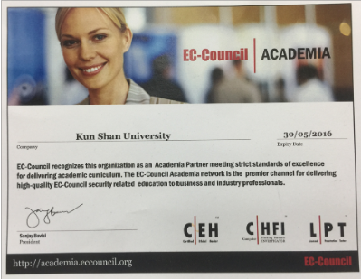

# 恩師 龍大大 基本資料

| CEH | CHFI|
|---| ---|
|[駭客殺手–CEH認證課程](https://www.uuu.com.tw/Course/Show/300/EC-Council-CEH-7-%E9%A7%AD%E5%AE%A2%E6%8A%80%E8%A1%93%E5%B0%88%E5%AE%B6%E8%AA%8D%E8%AD%89%E8%AA%B2%E7%A8%8B)|[CHFI資安鑑識調查專家](https://www.uuu.com.tw/Course/Show/1810/EC-Council-CHFI%E8%B3%87%E5%AE%89%E9%91%91%E8%AD%98%E8%AA%BF%E6%9F%A5%E5%B0%88%E5%AE%B6%E8%AA%8D%E8%AD%89%E8%AA%B2%E7%A8%8B)|
| ||

#### 崑山資工 CEH 耀眼成果
- 103年21名師生成功取得CEH證照(第8版)
- 105年CEH證照更新版本為第9版(較前版困難) 9位學生成功順利取得CEH證照
  

#### IPAS 中階 資安工程師 證照班 無可匹敵

#### 恩師龍大大獲獎資料
 
 
