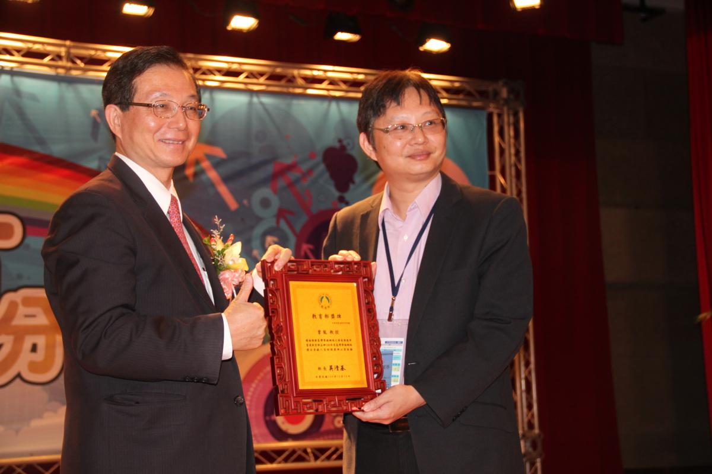

# 資安宣言

# 崑山駭客攻防實戰營 課程表
| 時間 | 活動 |
|---|---|
|9:30-10:00|	報到|
|10:00-11:30|	[駭客攻防實戰營:Kali linux 攻擊與滲透測試技術](/駭客攻防實戰)|
|11:30-11:50|	Bonus [撰寫你的學習歷程](/撰寫學習歷程)|
|11:50-13:10|	午餐|
|13:10-14:20|	[網站滲透測試](/網站滲透測試)|
|14:20-14:40|	[人生的第一張資安證照:如何考取IPAS 資訊安全工程師初階證照](/IPAS初階證照)|
|14:40-15:00|	拍照|
|15:00|	賦歸|
|3:10-3:50|	駭客攻防實戰營(2):如何阻擋駭客攻擊?|
|3:50-4:00|	中場休息|

# 恩師 龍大大
| CEH | CHFI|
|---| ---|
|[駭客殺手–CEH認證課程](https://www.uuu.com.tw/Course/Show/300/EC-Council-CEH-7-%E9%A7%AD%E5%AE%A2%E6%8A%80%E8%A1%93%E5%B0%88%E5%AE%B6%E8%AA%8D%E8%AD%89%E8%AA%B2%E7%A8%8B)|[CHFI資安鑑識調查專家](https://www.uuu.com.tw/Course/Show/1810/EC-Council-CHFI%E8%B3%87%E5%AE%89%E9%91%91%E8%AD%98%E8%AA%BF%E6%9F%A5%E5%B0%88%E5%AE%B6%E8%AA%8D%E8%AD%89%E8%AA%B2%E7%A8%8B)|
| ||

 
 

