# 正常執行功能: www.ksu.edu.tw
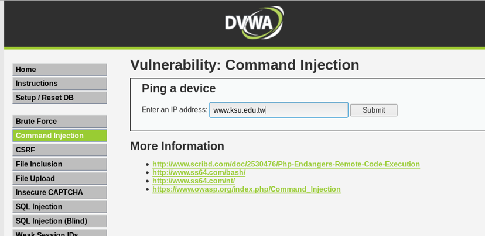

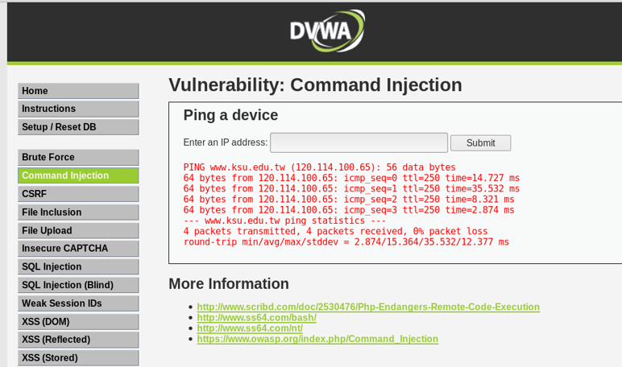

# 攻擊1:www.ksu.edu.tw; cat /etc/passwd

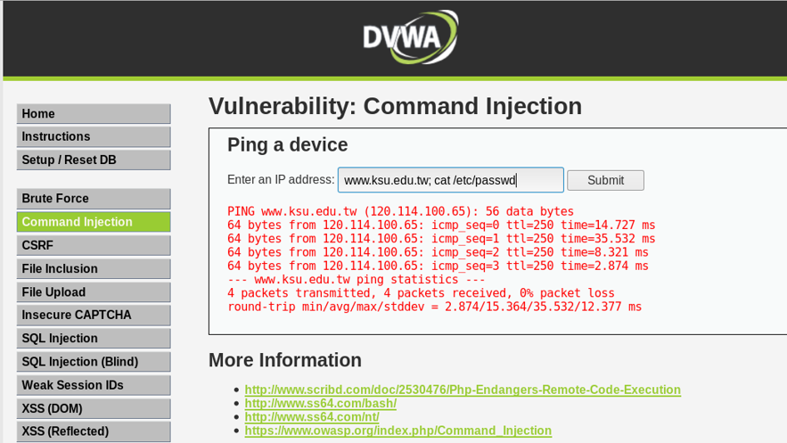

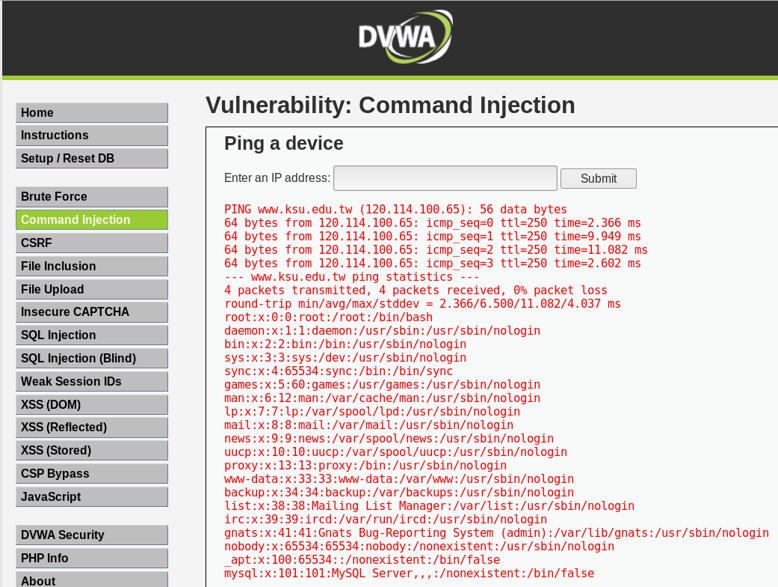

### 原始碼分析 防禦指數 0:毫無作為
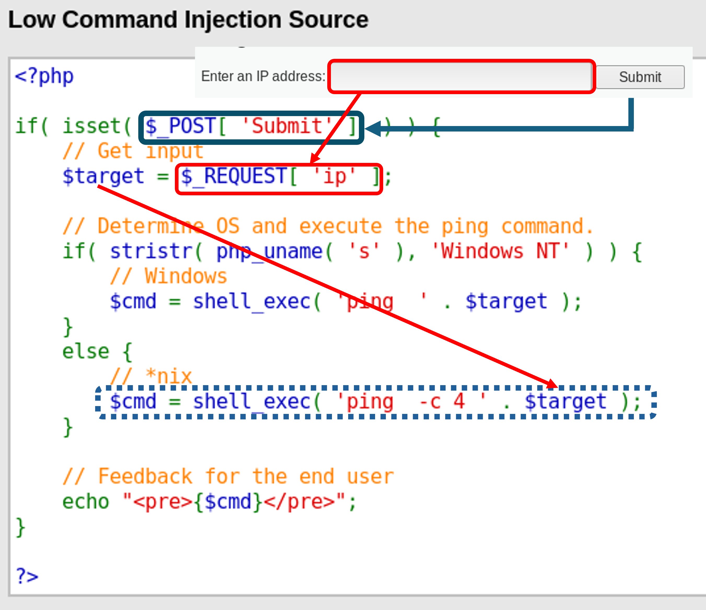

### 作業系統指令串接 == > Windows: &&  Linux: ;
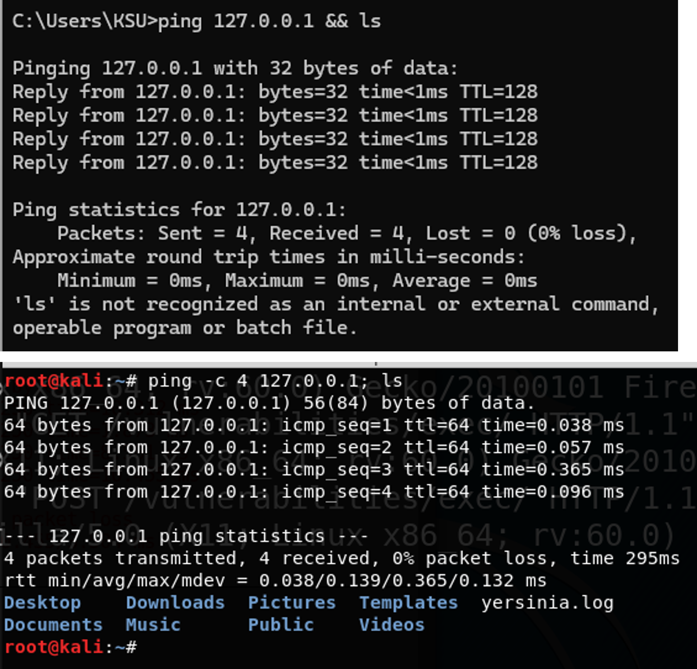

# 防禦1:中階防禦 
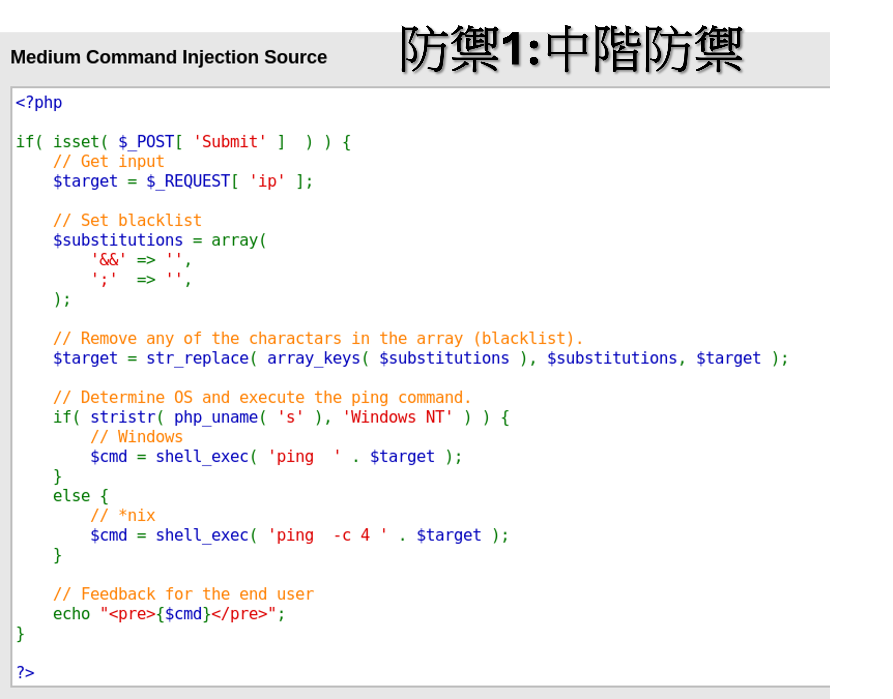

# 設定成medium

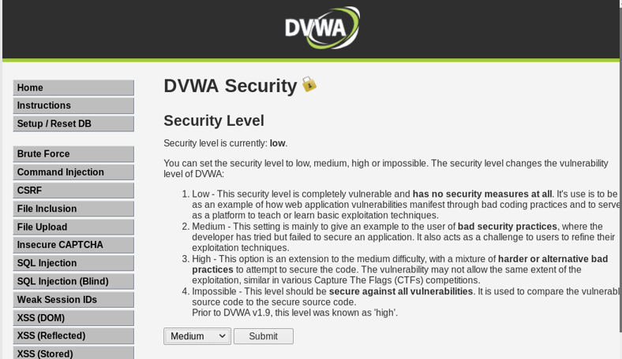

# 攻擊1:www.ksu.edu.tw; cat /etc/passwd  == > 攻擊失敗!

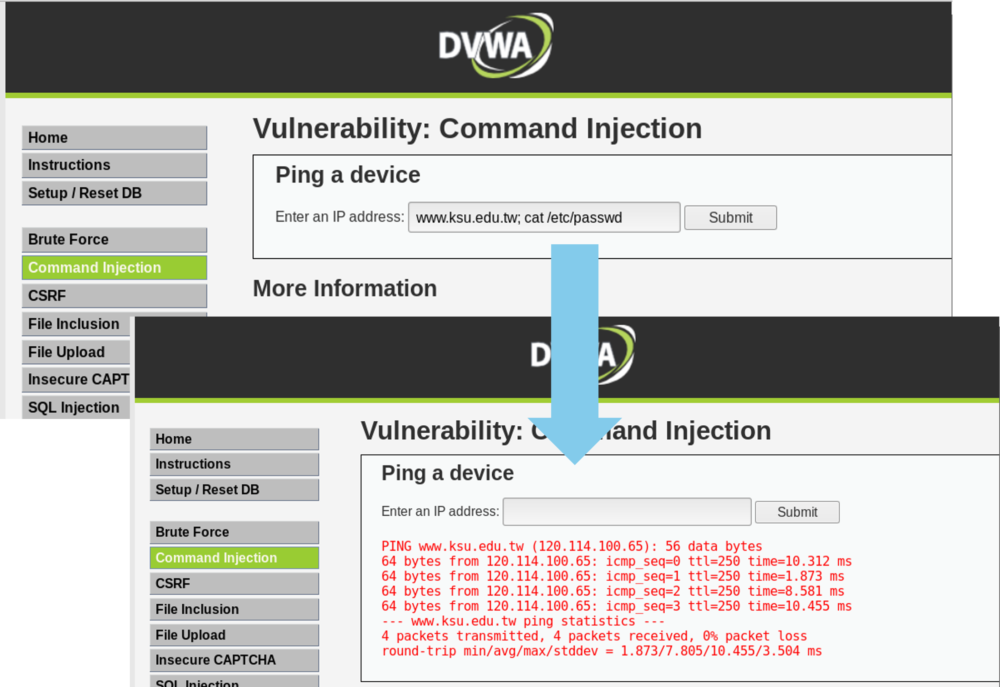

# 攻擊2: 127.0.0.1 |  cat /etc/passwd
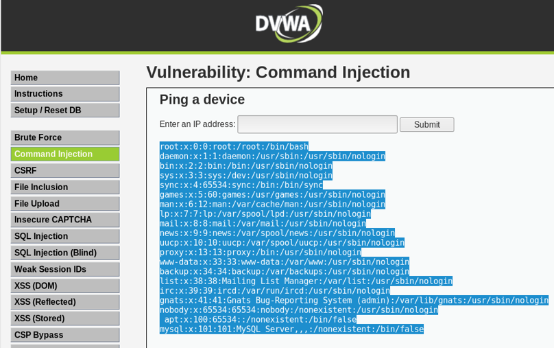
# 防禦2:高階防禦

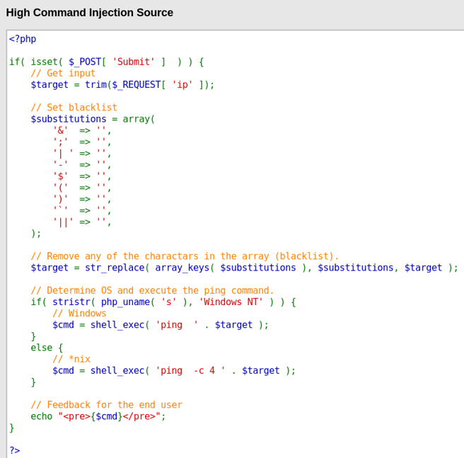
# 攻擊3: 127.0.0.1 ||  cat /etc/passwd
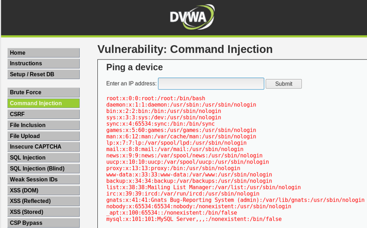
# 防禦3:完美防禦(Impossible)
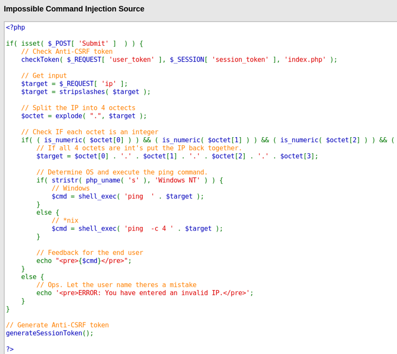

