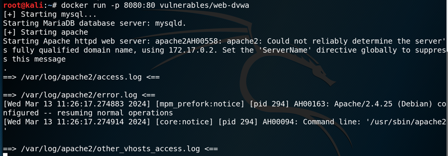
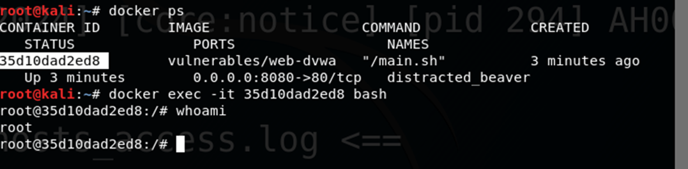
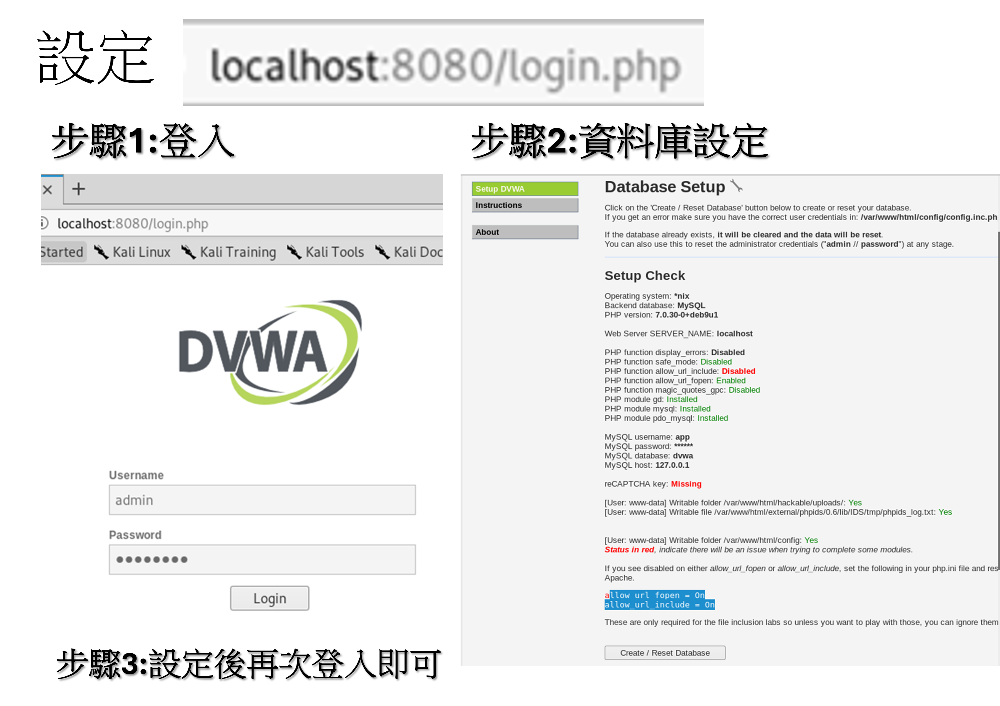
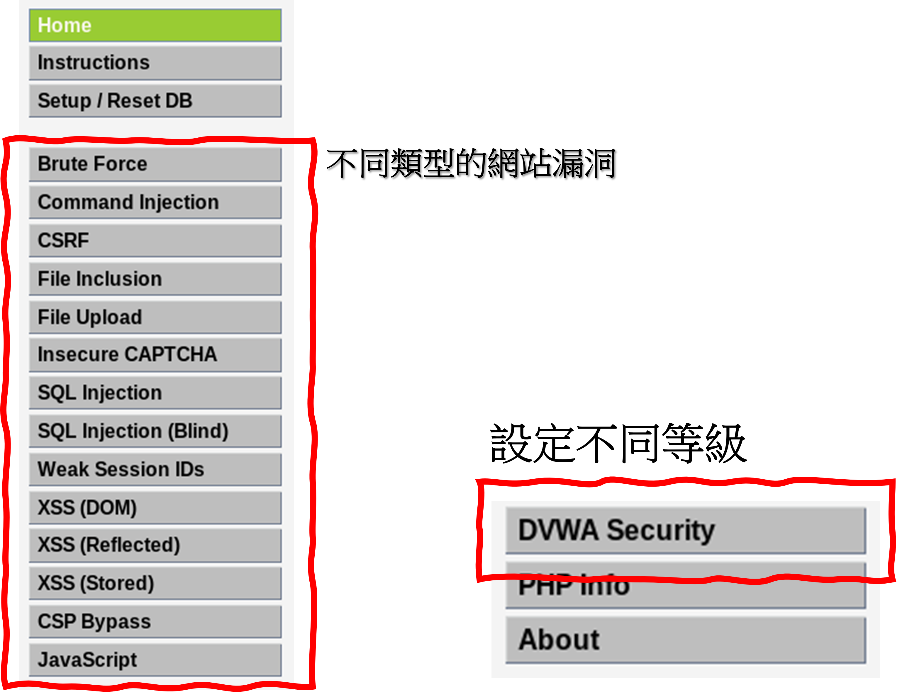

# 使用[docker](docker.md)建置DVWA網站漏洞平台
## 步驟一:  下載 == > docker pull vulnerables/web-dvwa
## 步驟二: 建置  == > docker run指令

## 登入到container 檢視相關設定 Docker exec

## 設定DVWA網站漏洞平台 ==> 再次登入 即可使用

## 設定DVWA網站漏洞平台的難度等級

