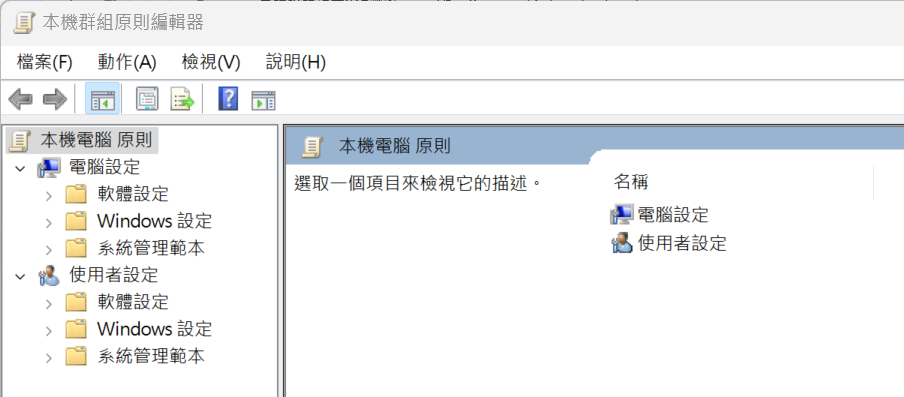

# 你必須要知道的Windows作業系統常用工具

## `工作(Task)` 相關
- 工作管理員(TaksManager)

- 教科書及linux 都是用`process(行程)` 微軟硬是要新創`工作(Task)` 
  - 工作排程器(Task Scheduler)~~[中文版](https://learn.microsoft.com/zh-tw/windows/win32/taskschd/about-the-task-scheduler) [英文版](https://learn.microsoft.com/zh-tw/windows/win32/taskschd/task-scheduler-start-page)
    - [Windows 工作排程器：每天自動關機教學與範例](https://officeguide.cc/windows-task-scheduler-auto-shutdown-tutorial/)

## Windows Service
- services.msc

## Windows 日誌
- 事件檢視器(EventViewser)

- gpedit.msc

