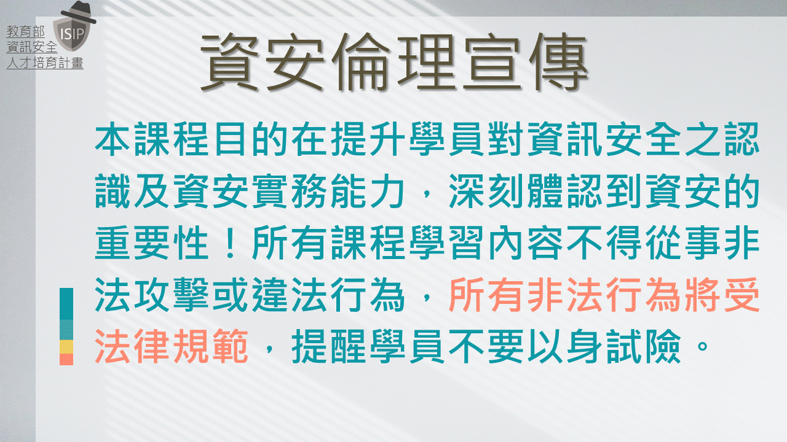

### |[恩師龍大大的高中職資安課程](./HIGH/readme.md)| [IPAS 資安工程師證照班](./IPAS/readme.md) | [恩師龍大大的龐大資安課程](./cource/readme.md)|

# 崑山駭客攻防實戰營 課程表
| 時間 | 活動 |
|---|---|
|12:50-1:00|	報到|
|1:00-1:50|	駭客攻防實戰營(1):Kali linux 攻擊與滲透測試技術[點選看看操作手冊](attack&defnese.md)|
|1:50-3:00|	崑山技職教育的特色(演講)|
|3:10-3:50|	駭客攻防實戰營(2):如何阻擋駭客攻擊?|
|3:50-4:00|	中場休息|
|4:00-4:30|	人生的第一張資安證照:如何考取IPAS 資訊安全工程師初階證照|
|4:30|	賦歸|

# 恩師 龍大大
| CEH | CHFI|
|---| ---|
|[駭客殺手–CEH認證課程](https://www.uuu.com.tw/Course/Show/300/EC-Council-CEH-7-%E9%A7%AD%E5%AE%A2%E6%8A%80%E8%A1%93%E5%B0%88%E5%AE%B6%E8%AA%8D%E8%AD%89%E8%AA%B2%E7%A8%8B)|[CHFI資安鑑識調查專家](https://www.uuu.com.tw/Course/Show/1810/EC-Council-CHFI%E8%B3%87%E5%AE%89%E9%91%91%E8%AD%98%E8%AA%BF%E6%9F%A5%E5%B0%88%E5%AE%B6%E8%AA%8D%E8%AD%89%E8%AA%B2%E7%A8%8B)|
| ||

 
 
# 資安宣言

